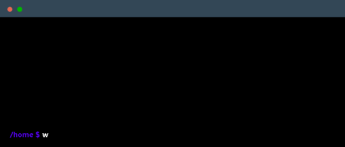

 

  

## 👋 About Me

Hi! I'm Marc, an engineering student passionate about technology, software, and building useful systems.

My main interests lie in automation, algorithm design, and creative coding. I'm familiar with Python, C++, Java, and web development stacks. I also enjoy combining design and code — whether it's 3D modeling in Blender, optimizing interfaces, or working with sensors and hardware.

I'm constantly learning and experimenting with new tools: cloud platforms, scripting, data visualization, or AI models — anything that helps turn ideas into working solutions.

I like clean code, practical learning, and sharing projects that combine technical depth with real-world utility.

---
🎓 **Student at**: UPC - ESEIAAT (Universitat Politècnica de Catalunya)  
🌍 **Languages**: Spanish & Catalan (Native), English (B2), French (A2)  
🛠️ **Tech focus**: CAD, automation, databases, front-end, and AI tools  
🚀 **Passions**: Open source, digital design, education, and health tech  
📫 **Contact**: marc.ortiz.segura@gmail.com

## 💻 Technical Skills

  <a href="https://skillicons.dev">
    
     
    
  </a>

---
### Employer?
> [!IMPORTANT]  
> <a href="https://drive.google.com/file/d/1GR6GPUxDptilxSkhVQ-0_raT8bgqNaoc/view?usp=drive_link" download>Download my resume</a>

